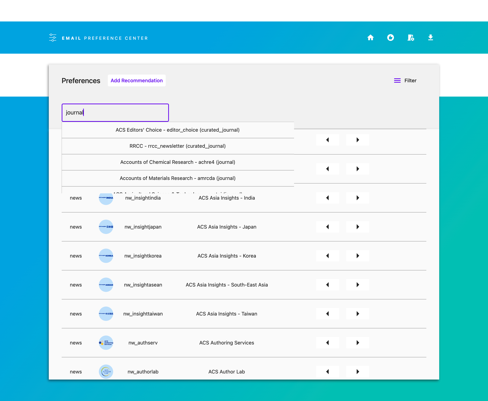
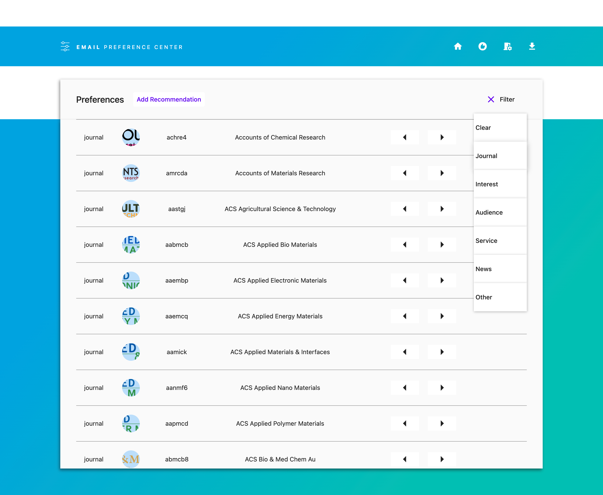

# Projects for ACS

## [2021 Coden conversion tool](/coden_tool)

* JavaScript
* HTML

Converts between different naming patterns used for journals.
Multiple conversions can be done at once and the results can be copy/pasted out.
No output is given for any invalid entries.

The tool is only used internally and is meant to be serverless so any updates for new journals requires adding to the code.
A python file is provided to write javascript object code that can be copied into the html file.

## [2021 Email recommendation preference manager](/preference_center_web)

* Flutter web (Dart)

A Flutter based web-app to manage email preferences. Uses a graph-like data structure to store relationships between which journals to recommend based on current reading habits.

ACS Server calls were removed and recommendations shown in the demo are randomly generated.

</img>
</img>

## [2017 XML Parser](/parser)

* Java
* XML

A XML Parser written in Java to read the ACS journal archive and extract article contents.
The tool attempts to match newly parsed citations to existing ones in the database.
It contains a command-line tool and a basic GUI.

Delivered the tool with a populated SQL table containing authors, citations, and other metadata.
I removed some of the IP addresses for accessing ACS data so the SQL writer no longer works.